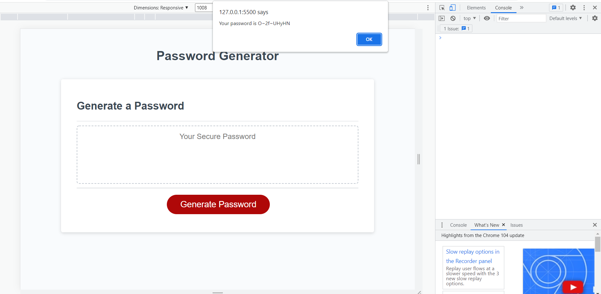

# Week Three Challenge: Password Generator

## Description

This repository is where I refactor code to create a functional password generator which displays a password that matches user-selected criteria.

## Installation

N/A

## Usage

Click the 'Generate Password' button to initiate the password criteria selection prompts. Enter a length between 8 and 128 characters (inclusive) and then select whether your password should include numbers, lower case letters, upper case letters, or special characters. Once criteria has been confirmed, your generated password will be displayed in an alert box.

Website URL: (https://bechedley.github.io/password-generator/)

    

## Credits

The following resources were referenced to ensure best practice and adherence to appropriate conventions:

Sample code provided by Monash University.

Index of special characters: Password Special Characters by The Open Web Application Security Project (OWASP) (https://owasp.org/www-community/password-special-characters)

Common js functions and parameters, for loops and arrays: JS CheatSheet by HTML CheatSheet (https://htmlcheatsheet.com/js/)

Information on using Math.random: Math.random() by mdn web docs (https://developer.mozilla.org/en-US/docs/Web/JavaScript/Reference/Global_Objects/Math/random)

Information on methods to alter arrays and how they affect the length of the array. This helped me determine why my original attempts to alter a single array to match the selected criteria by removing the false values would create an error in the math.Random function reading the array length: 9 Ways to Remove Elements from a JavaScript Array - Plus How to Safely Clear JavaScript Arrays by LOVE2DEV (https://love2dev.com/blog/javascript-remove-from-array/)

## License

Licensed under the standard MIT license. Please refer to the license in the repo for more information.